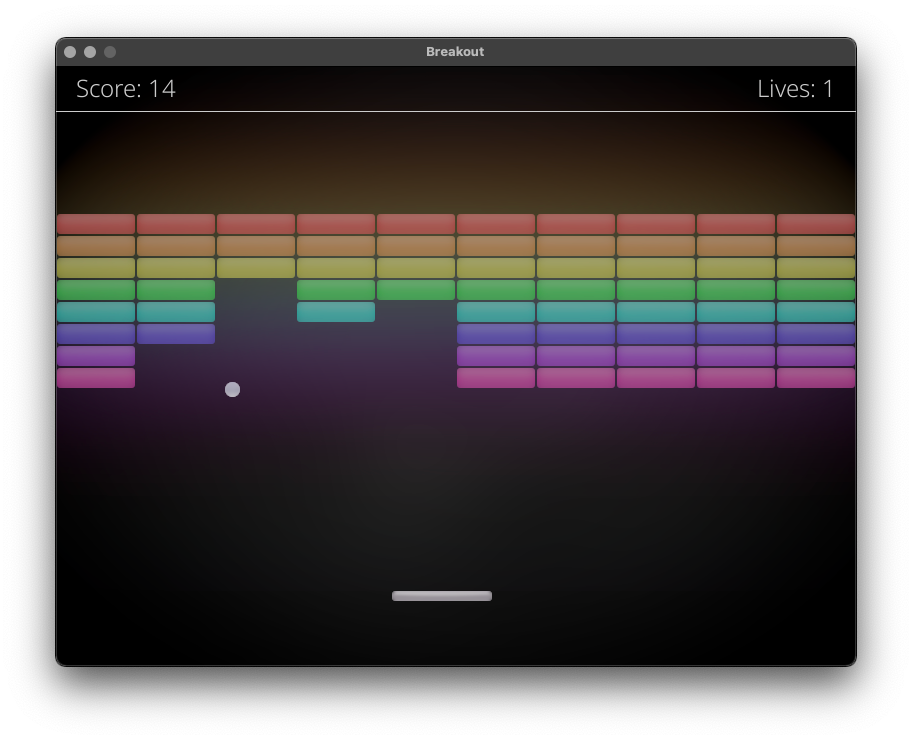
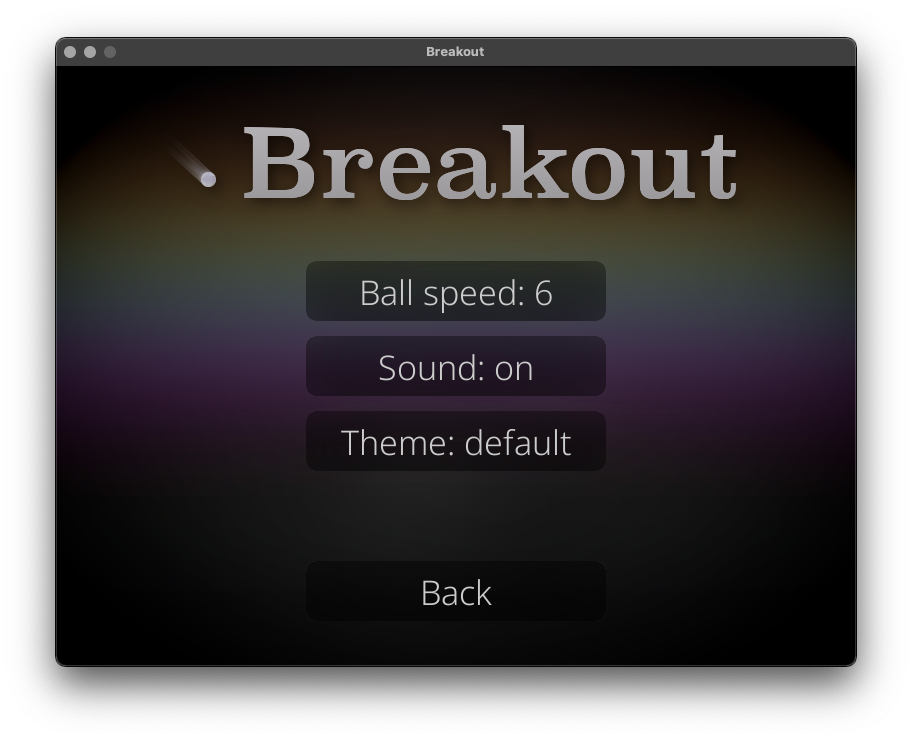

<p align="center">
  
</p>

# Pygame Breakout Game


## Table of contents
* [General info](#general-info)
* [Demonstration](#demonstration)
* [Setup](#setup)

## General info
This is a clone of Atari's game Breakout. It was coded in [Python](https://www.python.org) using [PyGame](https://www.pygame.org) package as a school assignment.

To code the game I followed those tutorials:
* [Pygame Breakout tutorial on 101computing.net](https://www.101computing.net/breakout-tutorial-using-pygame-getting-started/)
* [Baraltech's making a menu screen tutorial](https://www.youtube.com/watch?v=GMBqjxcKogA)
* [LeMaster Tech's pausing a game tutorial](https://www.youtube.com/watch?v=AIamQfL9d1I)

The graphic resources were made using [GIMP](https://www.gimp.org).
Sounds are from [Pixabay](https://pixabay.com), and fonts are from [Google Fonts](https://fonts.google.com).
	
## Demonstration
Main goal of the game is to break all blocks using the paddle, which is controlled by mouse.
<p align="center">
  
</p>
Apart from the gameplay, the game offers customizable options, such as changing a theme or adjusting the ball speed.
<p align="center">
  
</p>

## Setup
To run the game, follow these steps:

1. **Clone the repository:**
    ```
    git clone https://github.com/nik5677/breakout.git
    cd breakout
    ```
2. **Create and activate a virtual environment:**
    ```
    python3 -m venv venv
    source venv/bin/activate
    ```
   *on Windows:*
   ```
    python3 -m venv venv
    venv/Scripts/activate
    ```
3. **Install the required libraries:**
    ```
    pip install -r requirements.txt
    ```
4. **Run the game:**
    ```
    python3 main.py
    ```
